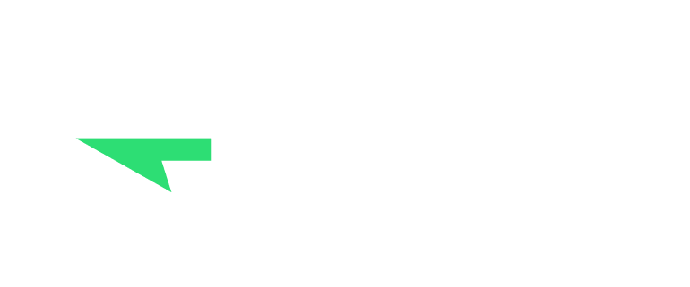

Today is Thanksgiving, and one thing I'm thankful for is this **open-source community** I'm lucky to be a part of.

Around the world and online, I have met folks who build cool things on the web,
whether OSS SaaS products or foundational libraries and building blocks for all to use and build on top of.
This open sharing of knowledge, code, and tools is one of the reasons why I left the music industry
8 years ago and settled on the Web as my building platform of choice.

At the beginning of 2025, I had two goals:
1. Speak at a conference _(done, three times 🇫🇷🇺🇸🇬🇧)_
2. Sign the Open Source Pledge

This year has been a wild ride, but the combination of being backed by
[GitHub sponsors](https://github.com/sponsors/franky47) (thank you! 💖)
and the recent winning of the Clerk Hackathon allows me to sign the
[Open Source Pledge](https://opensourcepledge.com) on behalf of nuqs for the first time this year.

I'm giving a total of **2700€** (USD $3,132) divided equally between the
maintainers of dependencies that help me build nuqs, and/or that I use in my client projects:

import { OpenSourcePledgeRecipient as OSSPR } from './open-source-pledge-recipient'

<ul className="list-none pl-0 ml-0">
  <li><OSSPR name="Andrey Sitnik" handle="ai" /> for [`size-limit`](https://npmjs.org/package/size-limit), to keep the bundle size small.</li>
  <li><OSSPR name="Anthony Fu" handle="antfu" />'s [collective](https://opencollective.com/antfu) for [`vitest`](https://vitest.dev), to make sure everything works fine.</li>
  <li><OSSPR name="Artem Zakharchenko" handle="kettanaito" /> for [`msw`](https://mswjs.io), the best network mocking library ever made.</li>
  <li><OSSPR name="Bjorn Lu" handle="bluwy" /> for [`publint`](https://publint.dev), to make sure I follow best practices.</li>
  <li><OSSPR name="Daishi Kato" handle="dai-shi" /> for [`jotai`](https://jotai.org), the gateway drug to signals for React devs.</li>
  <li><OSSPR name="Dominik Dorfmeister" handle="TkDodo" /> for [`@tanstack/react-query`](https://tanstack.com/query) & contributing to nuqs.</li>
  <li><OSSPR name="fregante" handle="fregante" /> for [Refined GitHub](https://github.com/refined-github/refined-github), so useful I can't use the stock UI anymore.</li>
  <li><OSSPR name="Fuma Nama" handle="fuma-nama" /> for [`fumadocs`](https://fumadocs.dev), which makes these interactive docs possible.</li>
  <li><OSSPR name="Kevin Deng" handle="sxzz" /> for [`tsdown`](https://tsdown.dev), the only bundler that ticked all the boxes.</li>
  <li><OSSPR name="Lars Kappert" handle="webpro" /> for [`knip`](https://knip.dev), to find unused code and ✂️ knip it off.</li>
  <li><OSSPR name="Matt Travi" handle="travi" /> for [`semantic-release`](https://semantic-release.gitbook.io/semantic-release), that lets me never think about version numbers again.</li>
  <li><OSSPR name="Mohammad Bagher" handle="Aslemammad" /> for [`pkg.pr.new`](https://pkg.pr.new), the maintainer's superpower: preview builds on PRs.</li>
  <li><OSSPR name="Nicolas Dubien" handle="dubzzz" /> for [`fast-check`](https://fast-check.dev), which fuzzy-tests URL encoding.</li>
  <li><OSSPR name="SaltyAom" handle="SaltyAom" /> for [`elysia`](https://elysiajs.com), a cool type-safe API framework I want to play more with.</li>
  <li><OSSPR name="Tom Lienard" handle="QuiiBz" /> for [`sherif`](https://npmjs.org/package/sherif) which enforces the Law in the nuqs monorepo.</li>
  <li><OSSPR name="Fastify" handle="fastify" />, that I use daily for client work as a backend framework.</li>
  <li><OSSPR name="Node.js" handle="nodejs" />, the heart of our FLOSS, community-driven ecosystem.</li>
  <li><OSSPR name="PNPM" handle="pnpm" />, my package manager of choice that links it all together.</li>
</ul>

 

To that list, we can add the following other OSS sponsorship payments I made during the year:

<ul className="list-none pl-0 ml-0">
  <li><OSSPR name="Alem Tuzlak" handle="alemtuzlak" />: $10</li>
  <li><OSSPR name="Dai" handle="dai" />: $174 <small>(I messed up `@dai-shi`'s sponsorship with the bulk CSV import, and so `@dai` got a lucky sponsorship 🙌)</small></li>
</ul>

<Callout title="Open Source Pledge summary for 2025" id="total">
  In total, this amounts to <strong>$3,316</strong> paid on behalf of the nuqs project (with myself as the sole "employee") to OSS maintainers.
</Callout>

Thank you to all of those wonderful folks and organisations, and happy Thanksgiving. 🫶